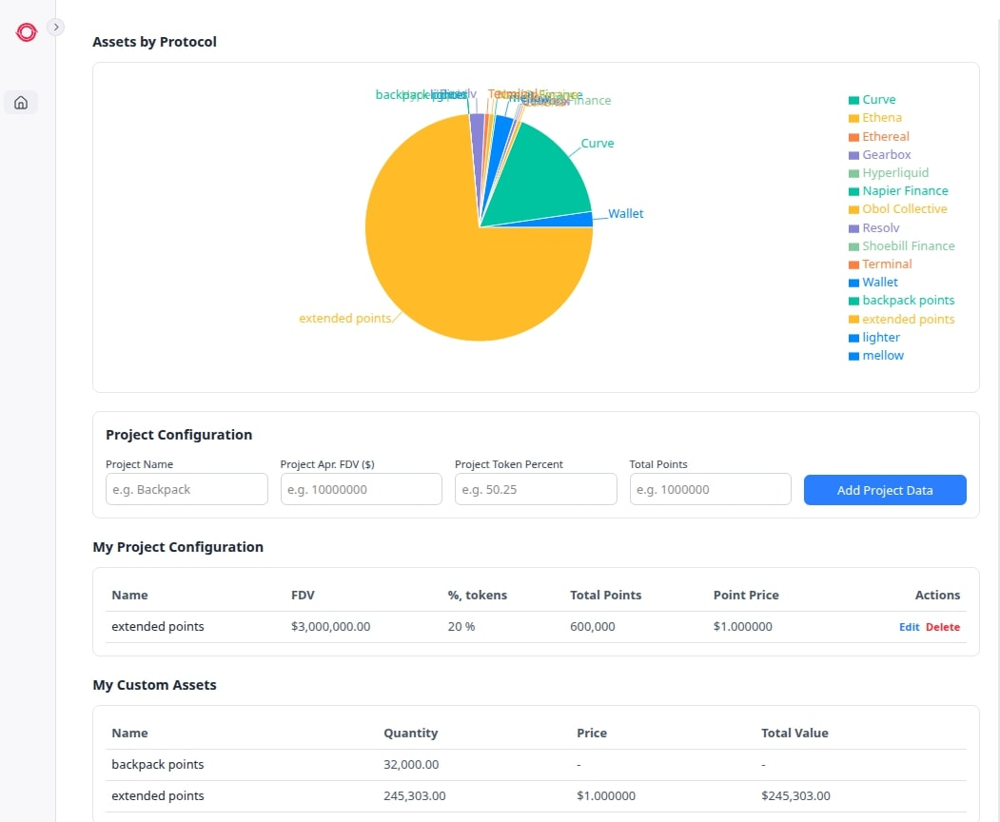
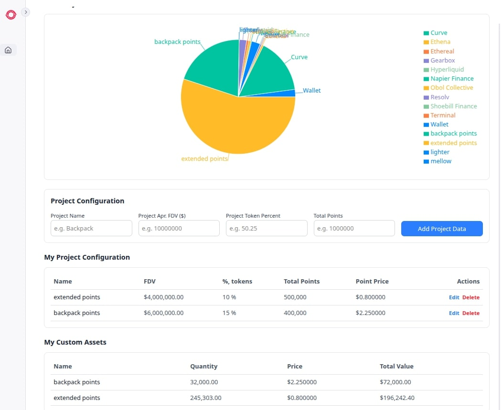

# 🏴‍☠️ Treasure Widget

A comprehensive crypto portfolio management dashboard, designed to help users track and value their digital assets across multiple protocols and early-stage projects.

## 🌟 What It Does

Treasure Widget is an innovative portfolio tracker that goes beyond traditional crypto portfolio management by allowing users to:

- **Track Multi-Protocol Assets**: Automatically fetch and display asset holdings across different DeFi protocols
- **Manage Project Points & Tokens**: Add and value early-stage project points/tokens that aren't yet listed on exchanges
- **Custom Valuation Models**: Configure FDV-based pricing for unlisted assets using project fundamentals
- **Visual Portfolio Analytics**: Interactive pie charts showing asset distribution and total portfolio value
- **Real-time Data Integration**: Connect with blockchain APIs to fetch live portfolio data

## 🚀 Key Features

### 📊 Portfolio Visualization
- Interactive pie charts powered by Recharts
- Real-time asset distribution across protocols
- Clean, modern UI with responsive design

### 🎯 Project Point Management
- Track points from airdrops, testnets, and early participation
- Custom pricing models based on project FDV and token allocation
- Automatic point price calculations: `(FDV × Token%) ÷ Total Points`

### 💼 Multi-Protocol Support
- Integration with Octav API for cross-chain portfolio data
- Support for Ethereum and other EVM networks
- Automatic asset aggregation and valuation

### 🔧 Advanced Configuration
- Editable project parameters (FDV, token percentage, total points)
- Local storage persistence for custom configurations
- Batch operations for managing multiple projects

## 🏃‍♂️ Tech Stack

- Next.js 15 with App Router
- React 19
- Tailwind CSS v4
- Shadcn UI
- TypeScript
- Radix UI primitives
- React Query for data fetching

### Installation

First, install the dependencies:

```bash
pnpm install
```

Then, run the development server:

```bash
pnpm dev
```

Open [http://localhost:3000](http://localhost:3000) with your browser to see the result.

### Environment Setup

Create a `.env.local` file in the root directory with the following variables:

```env

# Octav API Key (REQUIRED for Octav API)
# Get your API key at https://data.octav.fi
OCTAV_API_KEY=your_octav_api_key_here
EXTENDED_API_KEY="your_extended_api_key_here"
NEXT_PUBLIC_WALLET_ADDRESS="your_wallet_address_here"
```

## 📘 Usage Guide
1) Configure Your Projects
    For the widget to work correctly, you need to set the following project parameters:
    * **Project Name** — a unique name of the project. It must match the asset name returned by the points source API.
    * **FDV (Fully Diluted Valuation)** — the expected fully diluted valuation of the token.
    * **Token Percentage** — the percentage of tokens being distributed.
    * **Total Points** — the total number of points available for this project.

2) How Data Loading Works

    * If a project is not configured, only the raw data from the source will be used (e.g., the number of tokens or points).
    The source can be anything — you can add or adjust it to pull data from any provider.

    * If a project is configured and its name matches the token name from the source:
      * The token price and the estimated total value of the points are automatically fetched.
      * The system calculates the approximate value of the project based on the provided parameters.

All of this is visualized in a chart, showing the total value across your configured projects.

## Examples





